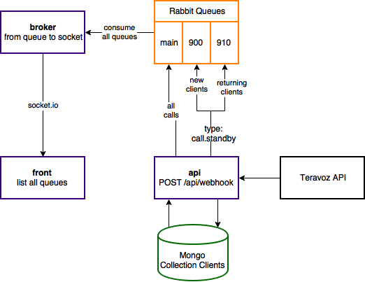

# Teravoz code-challenge

This project is the solution for the Teravoz code-challenge.

## Architecture

The architecture consists in an api, a database, a worker queue, a message broker and a front-end.



### api

The **api** expose the */api/webhook* endpoint to receive Http POST requests from the Teravoz API.
Once a request arrives, the back-end tries to get the client  (defined in this solution by the attribute *their_number*) in a Mongo databse, then send it to a RabbitMQ Queue according to the established requirements in the code-challenge specification.

There are 3 queues, that will be used in the following situations:

When type is call.standby and:
* the client does not exists, send to queue *900*.
* The client exists, send to queue *910*.

When type is any other value:
* Send to queue *main*.

After sent to que Queue, the back-end persists the user, in case he still do not exists in the database.

### broker

The **broker** consume all the 3 queues listed above (900, 910 and main).
Once a message arrives in any queue, the broker pops it from the queue and emit it by a web socket (socket.io) pipe to anyone listening.

The identification of the web socket pipes are the same identification of the RabbitMQ Queues: 900, 910 and main.

### front

Built in React, this **front-end** uses components of the Semantic IO library, and have a direct web socket pipe with the broker.

Once a message arrives, it is rendered by it own list component. Each EventList component has its own web socket pipe management.

The front-end was build using the [create-react-app](https://github.com/facebook/create-react-app) utility.

## Running it all

Make sure you have Docker and Node.js >= 8 installed to run this project.

> _Run nvm install 8 && nvm use 8_ to get the Node.js updated.


There is an order to up the services to get everything working.

### 1 - RabbitMQ and Mongo

To get the message server and the database running, run the command below in the project root directory:
```bash
docker-compose up
```
PS: Due to time for solving the challenge, and MacOS networking issues by Docker side, the projects api, broker and front were not dockerized.

There is a sample of how the Dockerfile for the project **api** should be:
```Dockerfile
FROM node:9.4.0-alpine
COPY . /code
WORKDIR /code
RUN npm install
CMD ['npm', 'start']
```

### 2 - Project api 

To get the api running on **localhost:9000**, run the command below in project **api** directory (./api):
```bash
npm install
npm start
```

The webhook endpoint waits for Http POST request in the path _/api/webhook_.

There are no validation of the input because we assume that  Teravoz API will send consolidated data.

### 3 - Project broker

To create the broker web socket pipe on **localhost:9001**, run the command below in project **broker** directory (./broker):
```bash
npm install
npm start
```

### 4 - Project front

To run the front-end on [localhost:3000](http://localhost:3000), run the command below in project **front** directory (./front):
```bash
npm install
npm start
```

### Testing the ecosystem

Open the front accessing [localhost:3000](http://localhost:3000).

So, make a post request to the localhost:9000/api/webhook.

```bash
curl -X POST \
  http://localhost:9000/api/webhook \
  -H 'Cache-Control: no-cache' \
  -H 'Content-Type: application/json' \
  -d '{
  "call_id": "1463669263.30033",
  "code": "123456",
  "type": "call.standby",
  "direction": "inbound",
  "our_number": "0800000000",
  "their_number": "11991910000",
  "timestamp": "2017-01-01T00:00:00Z"
}'
```

In the first request, a object containing an attribute queue with the value 900 should be returned. Also an item can be viewed in the front-end queue 900.

In the second request (the same command above), a object containing an attribute queue with the value 910 should be returned. Also an item can be viewed in the front-end queue 910.

Make any other request with a different type, so the same behavior described above can be seen, but now to the queue main.

```bash
curl -X POST \
  http://localhost:9000/api/webhook \
  -H 'Cache-Control: no-cache' \
  -H 'Content-Type: application/json' \
  -H 'Postman-Token: a4c9f38b-925f-865e-dc8b-fd4fc54f9b16' \
  -d '{
  "call_id": "1463669263.30033",
  "code": "123456",
  "type": "call.new",
  "direction": "inbound",
  "our_number": "0800000000",
  "their_number": "11999990000",
  "timestamp": "2017-01-01T00:00:00Z"
}'
```

## Development environment

* MacOS High Sierra 10.13.2
* Vim with [plugins](https://github.com/jaimelopesflores/vimfiles)
* Node.js v8.9.4
* MongoDB Docker image: latest
* RabbitMQ Docker image: latest

## Development time

* 2018, January 22th: From 19:30 to 23:59.
* 2018, January 23th: From 00:00 to 01:00 and 18:30 to 22:30.

## Tests?!

Due to shortage of time, unfortunately this project do not have tests of any kind, even knowking the importance of them to make this "ecosystem" reliable.

You can find a sample test implementation in [another company code-challenge](https://github.com/jaimelopesflores/cappta-code-challenge) I have made, just for validating purposes.